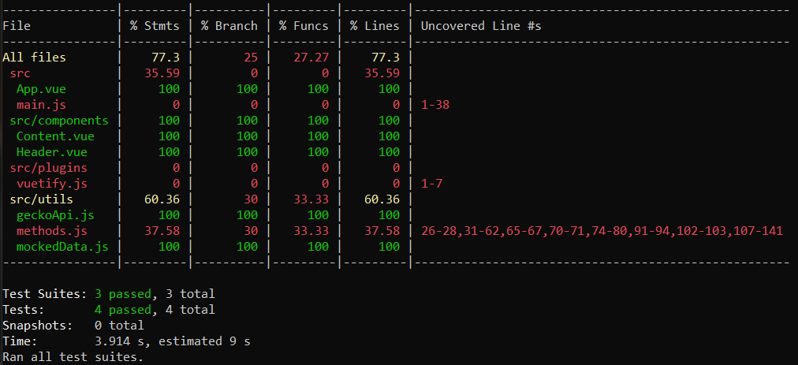
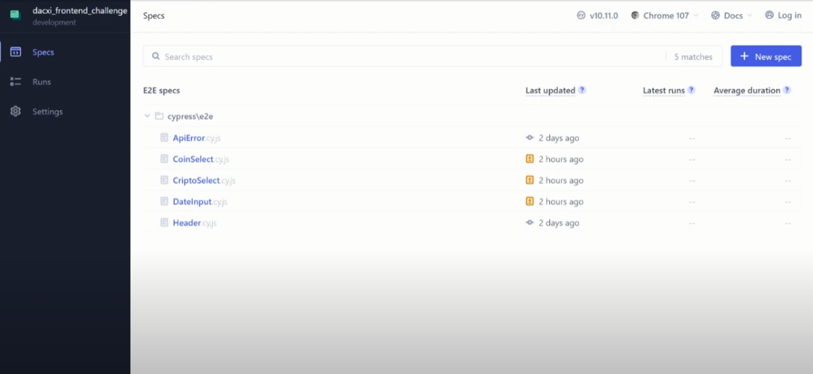

<h1>Dacxi Frontend Challenge</h1>

## Project functionalities

#### ● Displays current crypto price every 10 seconds

#### ● Displays current crypto prices from past 30 days

#### ● User can select which crypto he wants to see

#### ● The user can select which coin he wants to see the crypto price on

#### ● The user can filter the closest crypto price by inserting date and time

<br />

## You can use and test this project by clicking [here.](https://tlucas97.github.io/dacxi_frontend_challenge/)

<br />
<br />

<div style="margin: 1em 0">
    <h1>Jest Coverage</h1>
        

### To get test coverage use:

```
npm run test
```

</div>

<br />
<br />

<div style="margin: 1em 0">
    <h1>Cypress Coverage</h1>

#### Click on the image below to see the cypress tests

<a
href="https://www.youtube.com/watch?v=VGzuZrymQvI"
target="_blank">

</a>

### To open cypress use:

```
npm run cypress:open
```

</div>

<br />
<br />

# Resources used to build this project

#### [● Vue.js](https://vuejs.org/)

#### [● Vuetify](https://vuetifyjs.com/)

#### [● Tailwind CSS](https://tailwindcss.com/)

#### [● Vue Toastification](https://github.com/Maronato/vue-toastification)

#### [● Vue Apex Charts](https://apexcharts.com/docs/vue-charts/)

#### [● Axios](https://axios-http.com/ptbr/docs/intro)

#### [● Jest](https://jestjs.io/pt-BR/)

#### [● Testing Library](https://github.com/testing-library/vue-testing-library)

#### [● Cypress](https://www.cypress.io/)

#### [● Javascript](https://developer.mozilla.org/pt-BR/docs/Web/JavaScript/)

#### [● HTML5](https://developer.mozilla.org/pt-BR/docs/Web/HTML)

#### [● CSS3](https://developer.mozilla.org/pt-BR/docs/Web/CSS/)

<br />
<br />

# Project setup

```
npm install
```

### Compiles and hot-reloads for development

```
npm run dev
```

### Compiles and minifies for production

```
npm run build
```

### Customize configuration

See [Configuration Reference](https://cli.vuejs.org/config/).
